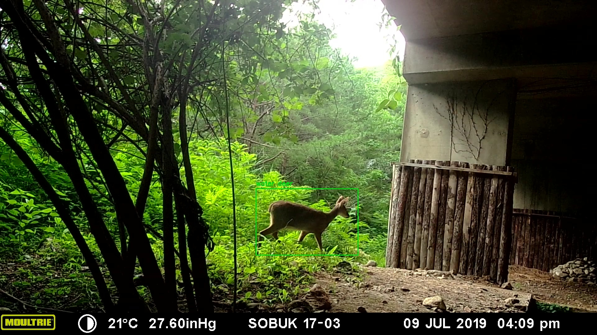

# Animal Detection using Raspberry Pi



라즈베리 파이에서 동영상을 촬영하고, 이를 서버에서 받아 Object Detection을 하는 프로그램입니다.

[imagezmq](https://github.com/jeffbass/imagezmq)를 사용하여 파이 카메라로 촬영된 영상을 PC 서버로 가져온다.

**`pi-server`**: **라즈베리파이에 다운로드**한다. 파이 카메라로부터 촬영된 영상을 직접 가져와 PC서버로 전송한다.

**`stream-server`**: **PC에 다운로드**한다. 라즈베리파이로부터 받은 영상을 웹에서 스트리밍하여 볼 수 있도록 한다.

# Gettting started

프로그램을 실행시키기 위하여 아래의 코드를 터미널에 입력하여 라이브러리들을 설치한다.

```Shell
$ pip install -r requirements.txt
```

# How to use

실행은 아래와 같이 한다.

## 주의사항

- [server.py](https://github.com/thispath98/Animal-Detection-using-Raspberry-Pi/tree/master/server.py)를 우선적으로 PC, 개인 노트북, 서버에서 실행한다. 그 이후 라즈베리 파이에서 [cam.py](https://github.com/thispath98/Animal-Detection-using-Raspberry-Pi/tree/master/cam.py)를 실행한다.
- 서버와 라즈베리 파이는 `동일한 네트워크 환경`(공유기 등)에 존재해야 한다.

## 1. Server

### optional arguments

```Shell
$ python server.py -h
usage: server.py [-h] [--input INPUT] [--weights WEIGHTS]
                 [--configure CONFIGURE] [--label LABEL]
                 [--confidence CONFIDENCE] [--threshold THRESHOLD]
                 [--frame FRAME]

Server gets Raspberry pi's capture through zmq

optional arguments:
  -h, --help            show this help message and exit
  --input INPUT         input video
  --weights WEIGHTS     yolo weights
  --configure CONFIGURE
                        yolo configure
  --label LABEL         coco class label
  --confidence CONFIDENCE
                        minimum confidence
  --threshold THRESHOLD
                        minimum threshold
  --frame FRAME         threshold of frame count
```

```Shell
$ python server.py --input {input}

e.g. python server.py              # 현재 pc에 연결된 웹캠으로 송출
    python server.py --input pi   # pi로부터 동영상 받아 송출
    python server.py --input data/car_on_road.mp4 # 동영상 송출
```

## 2. Raspberry Pi

### optional arguments

```Shell
python cam.py -h
usage: cam.py [-h] --ip IP

Raspberry pi passes its video capture to server

optional arguments:
  -h, --help  show this help message and exit
  --ip IP     server IP that we want to pass
```

```Shell
python cam.py --ip {server_ip}

e.g. python cam.py --ip 192.168.0.19
```

```
# 실제 실행!!!!!!!!!!!
python server.py --weights data/yolov4_tiny_class4.weights --configure data/yolov4_tiny_class4.cfg --label data/yolo_class4.names --input pi
```

# Reference

https://github.com/jeffbass/imagezmq

https://github.com/eplatero97/Object-Detection-and-Tracking-with-YOLOv3-SORT
